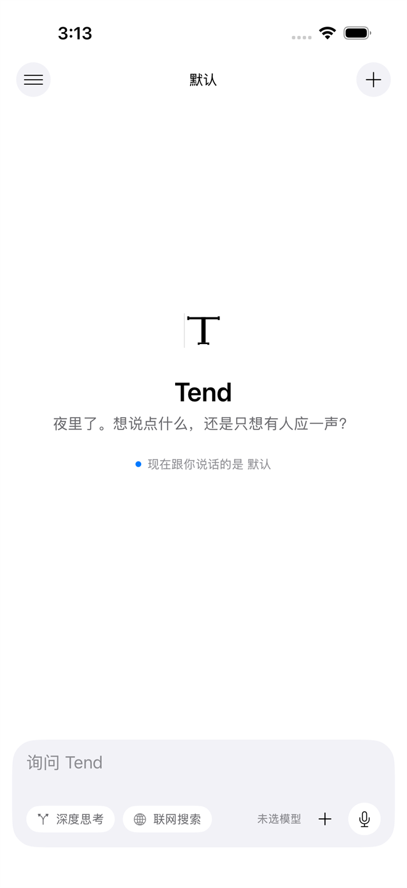
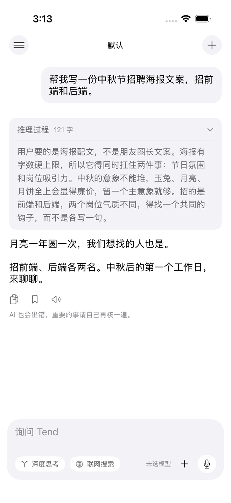
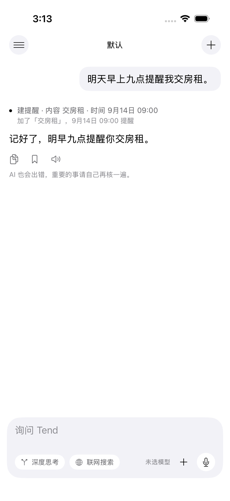
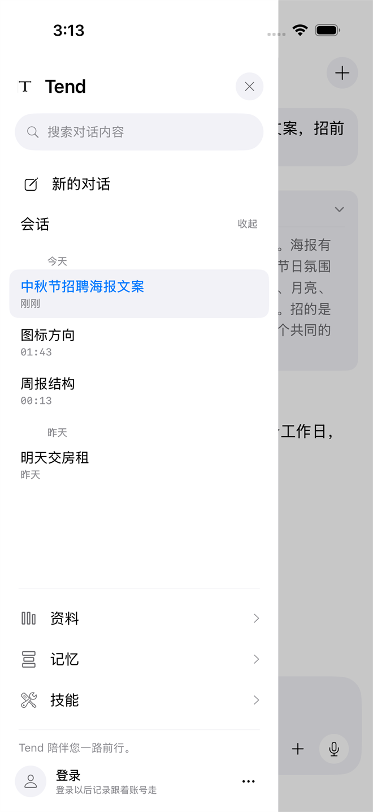
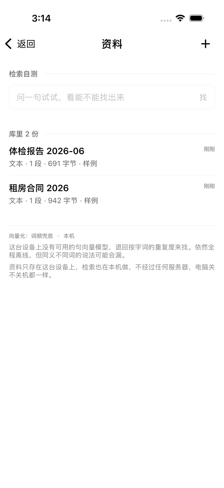
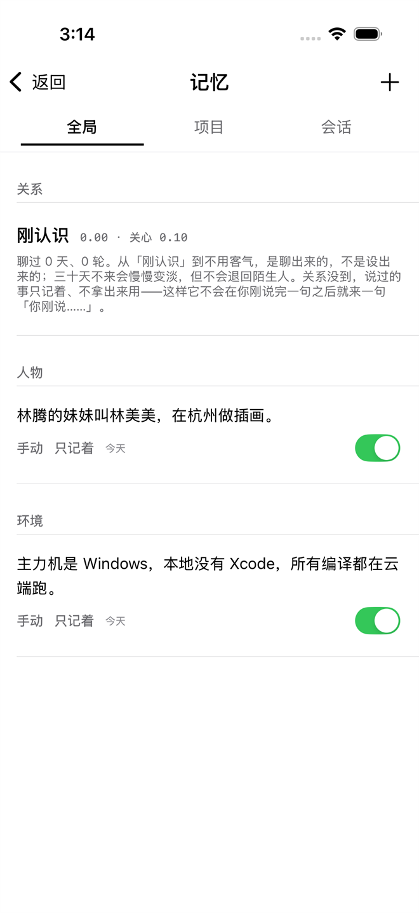
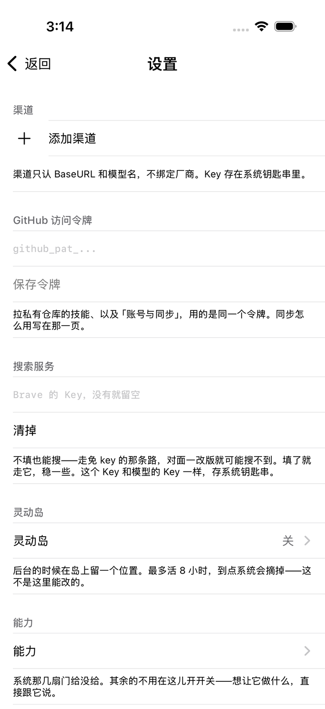

# Tend

一个多模型 AI 助手。iPhone 和安卓各有一个原生客户端，接你自己配的 OpenAI 兼容接口。

检索、记忆、语音、离线音色都在手机上算。我们没有自己的服务器，电脑关不关机都一样。

**[下载最新版](../../releases/latest)**

## 目录

- [界面](#界面)
- [装它](#装它)
- [先加一个渠道](#先加一个渠道)
- [能做什么](#能做什么)
- [不做什么](#不做什么)
- [关于服务器](#关于服务器)
- [已知问题与限制](#已知问题与限制)
- [常见问题](#常见问题)
- [这个仓库里有什么](#这个仓库里有什么)
- [给维护者](#给维护者)

## 界面

<p align="center">
  
  
  
  
</p>

<p align="center">
  
  
  
  
</p>

界面刻意避开常见 AI App 的样子。没有渐变，没有闪光星星，没有机器人头像，也没有左右气泡。
层次靠字号、字重和留白区分。系统玻璃只用在导航栏和工具栏，内容区一律不透明。

## 装它

### 安卓

从 [Releases](../../releases/latest) 下载 `Tend-x.y.z.apk`，点开安装，系统会问一次「允许安装未知应用」。

最低 Android 8.0。包用固定密钥签过名，以后升级直接覆盖安装，聊天记录不丢。

### iPhone

Releases 里的 `Tend-x.y.z-unsigned.ipa` 没有签名，苹果不允许直接安装，得用自己的 Apple ID 签一次。
AltStore、Sideloadly、Xcode 都行。

免费 Apple ID 签出来的证书 7 天到期，到期重签一次即可，聊天记录不丢。99 美元/年的开发者账号是一年。

最低 iOS 18。自用不必上架 App Store。

## 先加一个渠道

设置 → 渠道 → 加一条。要填三样：

| 填什么 | 说明 |
|---|---|
| 接口地址 | 例如 `https://api.deepseek.com/v1`，末尾不要带 `/chat/completions` |
| 路径 | 默认 `/chat/completions`，只有服务不一样才改 |
| 模型名 | 一条渠道下可以写多个，随时切 |

渠道不按厂商抽象，只认接口地址、路径、模型清单，以及推理字段叫什么名字。换服务加一条渠道，换模型不换人。

API Key 存在系统钥匙串里（安卓是 Keystore 加密的保险箱），不进数据库，不进备份。

内置了几个常见接入点的预置项（DeepSeek、通义千问、智谱、Kimi、硅基流动），点一下填好地址和模型名，填完照样能改。

## 能做什么

### 对话

- 一条渠道下挂多个模型，随时切。
- 人设：所有渠道所有模型共用一条人设。内置「默认」和「贾维斯」，也可以自己写。每个会话还能单独指定，一个窗口说中文、一个窗口说英文互不影响。
- 深度思考和联网搜索：输入框上的两个开关，状态会记住。联网搜索是真的发请求出去查：填了 Brave 的 Key 就走 Brave，没填、或者连不上 Brave（国内网络连不上），就走 Bing 的结果 RSS。搜不到就说搜不到，不会假装搜过。
- 推理过程：模型返回思维链就原文摆出来，默认展开、可以折叠。模型不返回的，界面上只有一行不可展开的「思考中」，不编造。
- 按住说话。系统识别能本地认就本地认，音频不上传。

### 记忆

- 全局、项目、会话三层。新对话继承全局层，项目层按需加载。
- 关系状态：它记得你们处到什么程度。刚认识和处了两年的，说话方式不一样。三十天不来会变淡，但不会退回陌生人。关系没到的时候，你说过的事它只记着，不拿出来用。
- 资料库：上传 txt、md、pdf、docx，在本机切块、算向量、做检索。iOS 用苹果的 NLEmbedding，安卓是本地向量化。不联网，不产生 API 费用。翻哪些资料由你指定。

### 动手

- 闹钟、日历、提醒是真的写进系统，到点真的响。
- 操控其他 App 只在你勾选过的白名单里。密码框和验证码不读不填，读出来的文字里六位以上的数字串会当场替换掉。
- 转账、付款、报验证码、报密码这一类工具不存在，模型不知道有这些东西。
- 分享扩展：在别的 App 里选中文字、图片、文件，直接丢进 Tend。

### 其他

- 念稿：iOS 上可以装自己的离线音色（sherpa-onnx）。贾维斯那条是英式英语音色，选中之后中文内容会自动交给中文音色。
- 账号与同步（可选）：加密档案放在你自己的 GitHub 私有仓库里，两台设备登同一个账号就同步。
- 灵动岛和状态栏待命。
- 备份与恢复：导出一个文件搬去新手机。API Key 不进备份。

## 不做什么

- 不假装。做不到就说做不到。图片读不上、搜索没有结果、模型不返回推理、网络断了，各自如实说。
- 不编造推理过程。
- 不做点下去没有实际动作的按钮。

## 关于服务器

没有我们自己的服务器。

- 检索、向量化、记忆、关系状态、语音识别、离线音色：在手机上算。
- 模型回答：请求发到你自己配的那个接口。
- 联网搜索打开时：请求发到 Bing 的结果 RSS；填了 Brave 的 Key 且网络能连通时走 Brave。
- 账号同步打开时：加密档案发到你自己的 GitHub 私有仓库。

没有这几条以外的外发请求。

## 已知问题与限制

这一节只讲是什么情况。

**源码不公开，无法审计。** `enc/` 和 `enc-android/` 里是密封过的工程文件，AES-256-GCM 加密，文件名是文件路径的哈希。所有关于安全和隐私的说法都无法被第三方验证，只能选择信或不信。

**项目很新。** 2026 年 9 月建仓，目前没有第三方反馈。迭代快说明还在很早期，接口和界面都可能变。

**授权范围。** 见 [LICENSE](LICENSE)。允许下载、安装、自己用；不允许反编译、改过之后再分发、售卖。

**iPhone 侧的依赖。** 免费 Apple ID 签出来的证书 7 天过期，要重新签。因为源码不公开，如果作者停更，没有别人能接手继续维护。

**安卓的加固有上限。** 做了 R8 混淆、只信系统证书、禁代理、签名校验。挡不住 root 之后用 Frida 改内存，这类工具面前本地校验都能绕过去。

**联网搜索的两条路不一样稳。** 免 Key 那条走 Bing 的结果 RSS（2026-09 实测国内可用）。
Brave 的接口在国内网络连不上——所以填了 Key 但连不上时会自动退回免 Key 那条路，界面上不会假装搜过。

**还没做的功能。** 用 App 控制电脑还没有做，内置播放器也还没做，这两条挂在 App 里的「还没做的」那一节。
安卓那边的离线音色和操控其他 App，还需要在真机上验证过才算数。

## 常见问题

**要自己准备 API Key 吗？**
要。Tend 不带 Key，也不转卖额度。去 DeepSeek 或任何 OpenAI 兼容的服务申请一个填进去。

**不用 Key 能用吗？**
不能。回答全部来自你配置的那个接口。

**iPhone 装完一周就不能用了？**
免费 Apple ID 签出来的证书 7 天到期，重签一次即可，聊天记录不丢。

**换手机怎么搬？**
设置 → 备份与恢复导出一个文件，或者用账号与同步。API Key 两种方式都不跟着走，要重新填。

**安卓和 iPhone 功能一样吗？**
尽量对齐，有差异会写明。比如安卓没有灵动岛，待命就做成状态栏上一条常驻通知。

## 这个仓库里有什么

没有源码。

`enc/`（iOS）和 `enc-android/`（安卓）里是密封过的工程文件，AES-256-GCM 加密，每个文件的文件名是它路径的哈希，从外面看不出项目结构。口令在 GitHub Secret（`TEND_SOURCE_KEY`）和作者本机各存一份。

编译在 GitHub Actions 上跑。流水线先把密文解开到临时目录，编完随临时目录一起消失。产物也封过再上传，正式发布时才解封放进 Releases。

这个仓库是拿来用的。

## 给维护者

需要 `TEND_SOURCE_KEY`（环境变量，或写进 `tools/.tend-key`，已被 .gitignore 排除）。

```sh
node tools/tendpack.js seal        --src <明文工程> --out enc
node tools/tendpack.js unseal      --src enc        --out <解到哪>
node tools/tendpack.js seal-file   --in <文件> --out <文件>
node tools/tendpack.js unseal-file --in <文件> --out <文件>

node tools/publish.js --src <iOS 明文工程> --note "这一版改了什么"
node tools/publish.js --src <安卓明文工程> --out enc-android --note "这一版改了什么"
```

工作流：

| 工作流 | 做什么 |
|---|---|
| `build` | 解开 iOS 密文，XcodeGen 生成工程，编无签名 ipa，封回去当 artifact |
| `android` | 解开安卓密文，Gradle 编译，签名 apk，封回去当 artifact |
| `screenshots` | 装进苹果模拟器，逐屏截图 |
| `android-shots` | 装进安卓模拟器，逐屏截图 |
| `genkey` | 生成安卓签名密钥，只跑一次 |

发版：等 Actions 绿，下 artifact，用 `unseal-file` 解封，放进 Releases，附上 SHA256。

## English

**Tend** is a multi-model AI assistant for iPhone and Android, written natively in SwiftUI and
Jetpack Compose. It talks to any OpenAI-compatible endpoint you configure yourself.

There is no server of ours. Retrieval, embeddings, memory, speech recognition and offline voice
synthesis all run on the device. The only outbound requests are the model endpoint you configure,
a search service when web search is on, and your own private GitHub repository if you enable sync.

The interface deliberately avoids the usual AI-app look: no gradients, no sparkle icons, no chat bubbles.

This repository contains no source code. The `enc/` directories hold sealed (AES-256-GCM) project
files that are only decrypted inside GitHub Actions for the duration of a build.
Download the app from [Releases](../../releases/latest).
